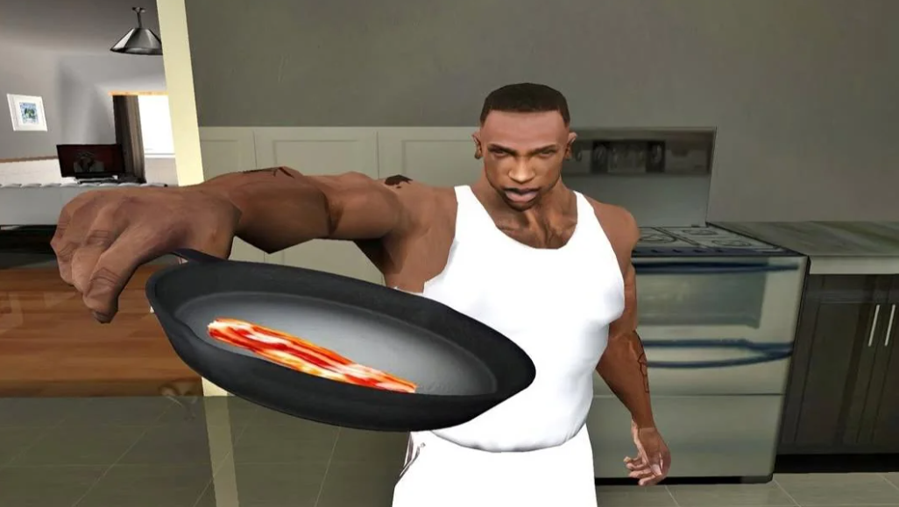

# Cadi - Unity Base Toolkit

A reusable foundation layer for Unity projects. Drop the `Cadi/` folder into your game, inherit from the right base class, and skip the part where you write the same boilerplate for the 47th time.

Built on **Unity 6** with **URP 17**. Targets PC (1920x1080, 60 fps). No `.asmdef` files -- everything compiles into default `Assembly-CSharp`.

---


<br><br>


## Systems

| System | What it does | Docs |
|---|---|---|
| [**CacherSystem**](#cachersystem) | Declarative component wiring -- no `GetComponent` calls, no drag-and-drop | [README](Assets/Cadi/Scripts/CacherSystem/README.md) |
| [**GraphixSystem**](#graphixsystem) | Selectable UI graphics framework -- grids, galleries, cards, option buttons | [README](Assets/Cadi/Scripts/UI/GraphicSystems/README.md) |
| [**Event System**](#event-system) | Typed, pooled, priority-based event bus with context/channel scoping | [README](Assets/Cadi/Scripts/EventSystem/README.md) |
| [**Custom Attributes**](#custom-attributes) | Inspector utilities that work with or without Odin | [README](Assets/Cadi/Scripts/CustomAttributes/README.md) |
| [**BlurKit**](#blurkit) | Frosted-glass UI blur for popups and overlays | [README](Assets/Cadi/Shaders/UI/BlurKit/README.md) |
| [**Extensions & Utilities**](#extensions--utilities) | Shorthand methods, singletons, debug helpers | -- |

---

## CacherSystem

**Mark fields with `[CachedField]`. References resolve themselves.**

```csharp
public class Weapon : CacherMonoBehaviour
{
    [SerializeField, CachedField]
    private Rigidbody m_Rigidbody;                        // from Self

    [SerializeField, CachedField(RefSearch.Children)]
    private List<ParticleSystem> m_MuzzleEffects;         // all in children
}
```

References are resolved at edit time, serialized, and validated at build time. A missing required reference fails the build -- not your player's session. The runtime path exists only for objects constructed dynamically.

No `Awake` boilerplate. No hand-wired inspector slots. No null-ref surprises.

[Full documentation ->](Assets/Cadi/Scripts/CacherSystem/README.md)

---

## Event System

**Typed event objects, pooled to avoid GC, dispatched by priority, scoped by context and channel.**

```csharp
using (var evt = DamageEvent.Rent())
{
    evt.Target = enemy;
    evt.Damage = 10;
    evt.SendGlobal();
}
```

Listeners register with a priority (`Critical` through `Lowest`). Higher-priority listeners run first and can `Consume()` the event to stop propagation. Context and channel scoping lets the same event type serve different systems without everyone hearing everything.

Safe add/remove during dispatch. No allocation per send. No direct references between systems.

[Full documentation ->](Assets/Cadi/Scripts/EventSystem/README.md)

---

## GraphixSystem

**A UI selection framework. An alternative to Button -- better, more versatile, and faster.**

Covers selectable image grids, galleries, option buttons, cards with frames, and any UI element that has "normal vs selected" visuals.

```csharp
m_Group.OnImage += (image, selected) =>
    Debug.Log($"Image {image.RuntimeID} selected: {selected}");

m_Group.SetContent(sprites, preserveAspect: true);
```

Single-select, multi-select with limits, locking, deselection rules, optional selection FX, outline support, and DOTween tweening -- all configured from the inspector. Children stay small, the group owns the rules.

[Full documentation ->](Assets/Cadi/Scripts/UI/GraphicSystems/README.md)

---

## Custom Attributes

**Four inspector attributes that work with or without Odin.**

| Attribute | What it does |
|---|---|
| `[Button]` | Clickable method button in the inspector. Supports parameters, persists values between sessions |
| `[ShowIf]` | Conditionally show/hide fields based on another field, property, or method |
| `[DynamicRange]` | Slider where min/max come from other fields instead of hardcoded values |
| `[SpritePreview]` | Inline sprite thumbnail preview. Respects atlas packing |

When Odin is present, `[Button]` inherits from Odin's own attribute so it renders natively. The rest use standard `PropertyDrawer` and just work.

[Full documentation ->](Assets/Cadi/Scripts/CustomAttributes/README.md)

---

## BlurKit

**Frosted-glass blur for UI overlays.** Captures the scene with a dedicated camera, applies a multi-pass separable blur, and displays the result on a `RawImage`. Background canvases are temporarily switched to Screen Space - Camera mode during capture.

```csharp
blur.EnableBlur();
blur.DisableBlur();
```

Drop the prefab, assign background canvases, set the blur amount. That is the entire setup.

[Full documentation ->](Assets/Cadi/Shaders/UI/BlurKit/README.md)

---

## Extensions & Utilities

### Extension Methods

| Class | Highlights |
|---|---|
| `CollectionExtensions` | List and dictionary helpers |
| `ColorExtensions` | Color manipulation |
| `EnumExtensions` | Enum utilities |
| `StringExtensions` | String helpers |
| `TransformExtensions` | Transform shortcuts |
| `Vector3Extensions` | Vector math |
| `UIExtensions` | UI-specific helpers (DOTween-guarded tween methods included) |

Component access shortcuts used throughout the codebase:

| Shorthand | Equivalent |
|---|---|
| `GC<T>()` | `GetComponent<T>()` |
| `GCIC<T>()` | `GetComponentInChildren<T>()` |
| `GCsIC<T>()` | `GetComponentsInChildren<T>()` |
| `GCIP<T>()` | `GetComponentInParent<T>()` |

### Singletons

`SingletonBehaviour<T>` -- auto-creates on first access, destroys duplicates, handles quit safety, supports `DontDestroyOnLoad`. Runs at execution order `-10000`.

`CacherSingleton<T>` -- same thing but with `[CachedField]` support. For singletons that also need auto-resolved references.

### Other Utilities

| Utility | What it does |
|---|---|
| `StringBuilderPool` | Single shared `StringBuilder`, cleared per use. Main-thread only |
| `GeneralSettings` | ScriptableObject data container with lazy `Get()` + editor auto-creation |
| `RuntimeDiagOverlay` | In-game debug overlay |
| `DebugSphere` / `DebugText` | Visual debug helpers |
| `CanvasOrderPolice` | Auto-manages Canvas sorting order |
| `CanvasPD` | Canvas pixel-density scaling |
| `BetterGridLayoutGroup` | Improved grid layout with better sizing |
| `UISlicedSpriteAnimator` | Frame-by-frame sliced sprite animation |

---

## Shaders

All shaders target URP.

| Shader | Category | Purpose |
|---|---|---|
| BlurKit | UI | Separable blur for frosted-glass overlays |
| UIAlphaOutline | UI | Outline shader used by `UIOutline.cs` |
| RadialDash | UI | Radial dash effect |
| TriangularDash | UI | Triangular dash variant |
| 2DFrost | 2D | Frost/glass effect |
| SketchLook | 3D | Non-photorealistic sketch outline |

---

<br><br>

## Optional Dependencies

Both are auto-detected. Neither is required. The project compiles cleanly without them.

**DOTween** -- Guarded by `CADI_DOTWEEN`. Auto-managed by `CadiDotweenDefineSetter.cs` which runs on every domain reload, detects DOTween via reflection, and sets the define. Never set it manually -- the script will fight you on the next reload.

**Odin Inspector** -- Guarded by `ODIN_INSPECTOR`. Auto-set by the Odin package itself. Gives you foldout groups, inline editors, and cleaner inspectors. Without it, everything still works, just less pretty.

---

## Conventions

**Field naming:** `m_` instance, `s_` static, `c_` constant. No exceptions.

**Serialization:** Always `[SerializeField] private`. No public fields for data.

**Resources loading:** ScriptableObject containers use a static `Get()` method with `Resources.Load` and editor-only auto-creation. Assets live at `Assets/Resources/Content/`.

---

## Folder Structure

```
Assets/Cadi/
  Scripts/
    CacherSystem/           -- component auto-resolution
      Editor/               -- inspector, menu commands, build check
    CustomAttributes/       -- [Button], [ShowIf], [DynamicRange], [SpritePreview]
      Editor/               -- property drawers
    EventSystem/            -- EM, Event, EventHub, PriorityList
    UI/
      Extensions/           -- BetterGridLayoutGroup, UISlicedSpriteAnimator
      FX/                   -- FXGraphix, UIFXPooler, UIOutline
      GraphicSystems/       -- Graphix, Selectix, SelectixGroup, Slot
      ScreenSystem/         -- screen state management
    Utility/
      DataSaving/           -- ScriptableObject data containers
      DebugHelpers/         -- DebugSphere, DebugText, RuntimeDiagOverlay
      Extensions/           -- extension method classes
  Shaders/
    UI/                     -- BlurKit, RadialDash, TriangularDash, UIAlphaOutline
    2D/                     -- 2DFrost
    3D/                     -- SketchLook
```

<br>

<br><br>
